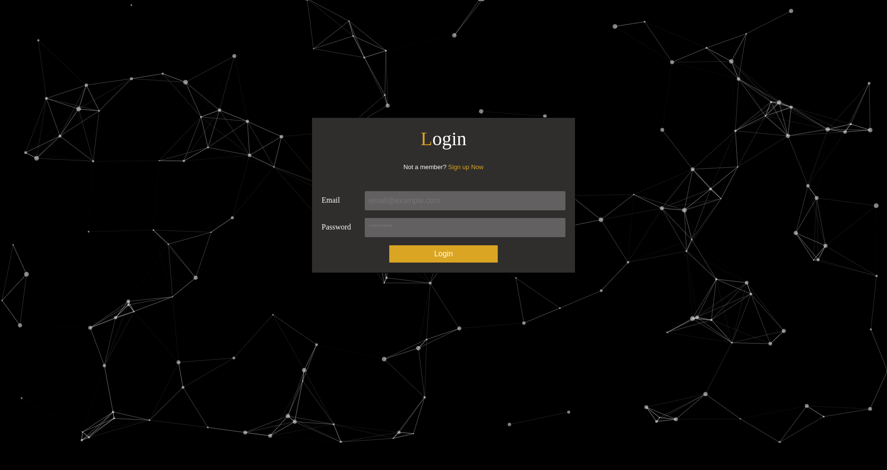
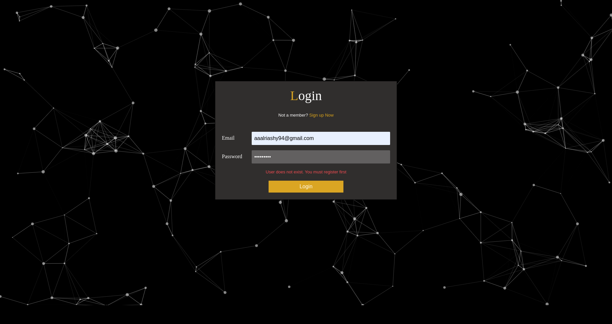
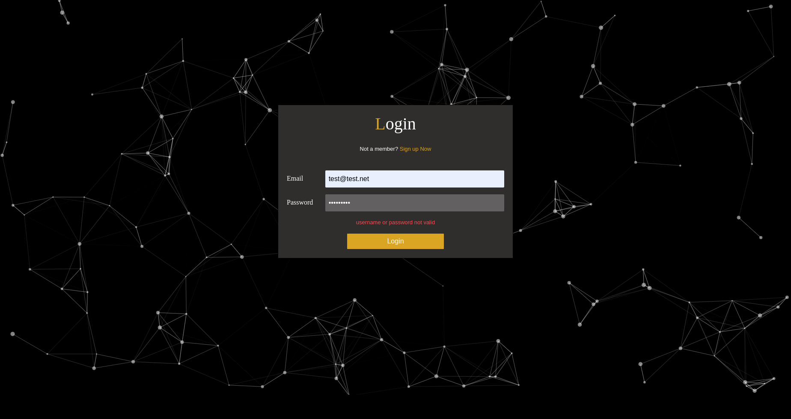
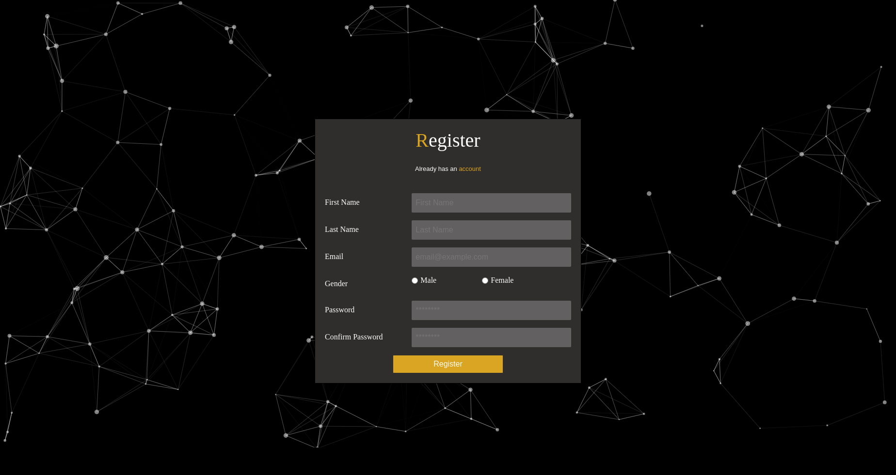
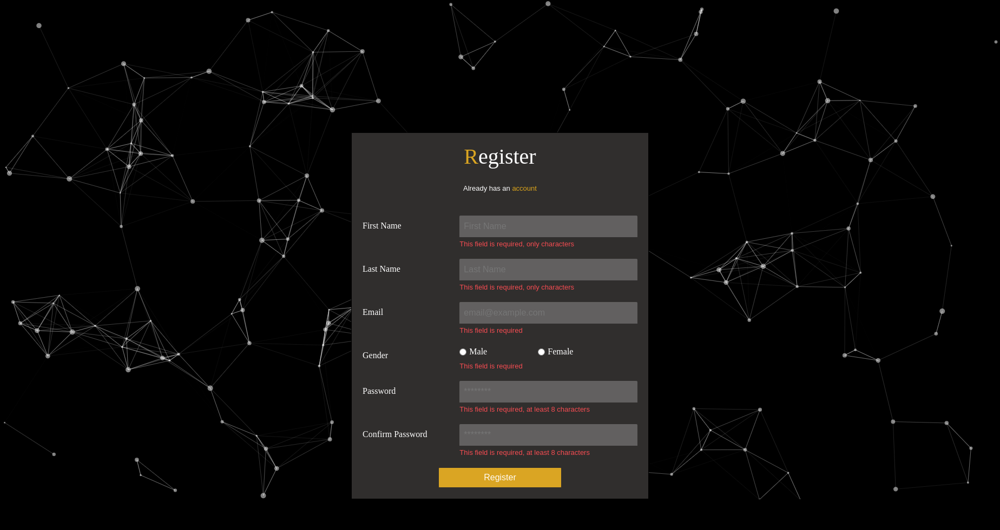
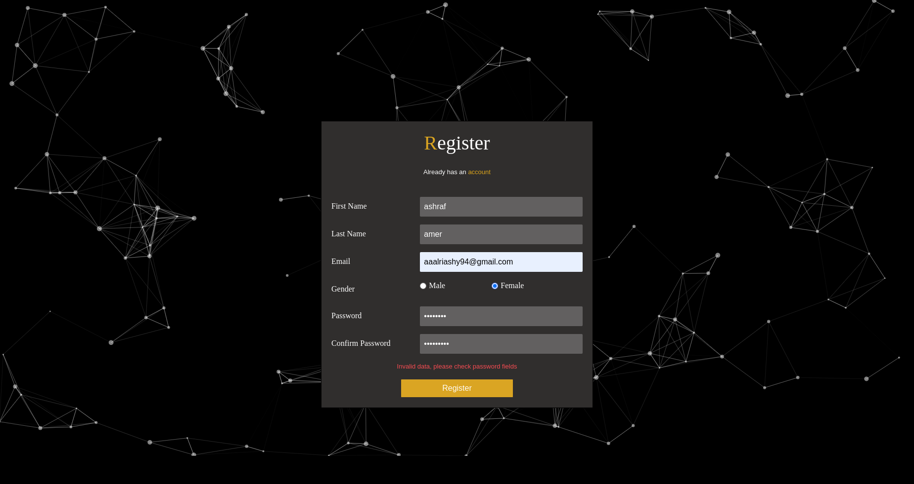
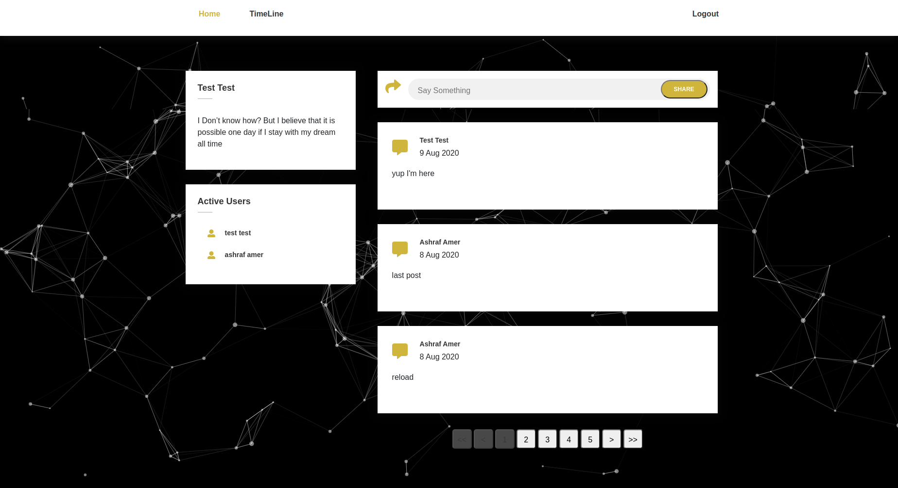
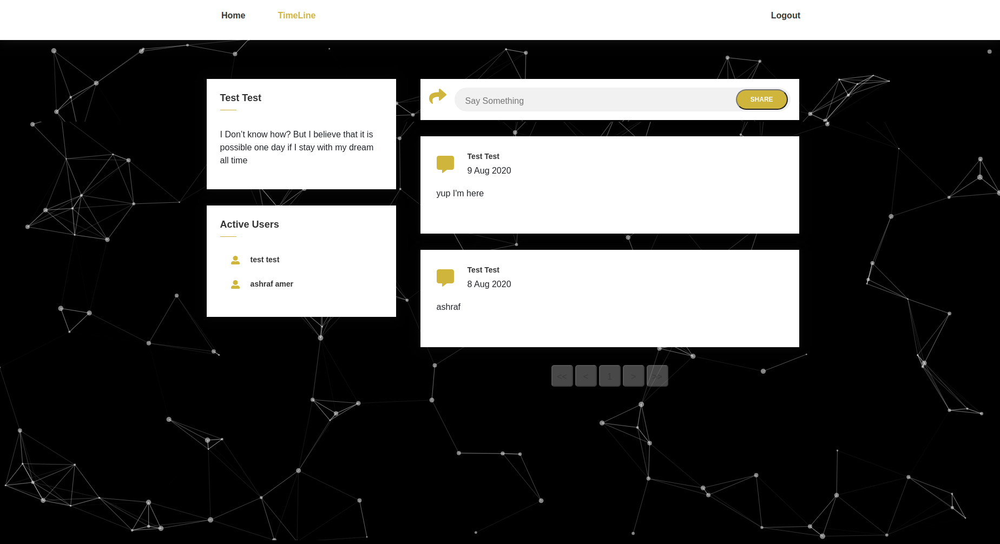

# Project Intro:

Simple Social media Application, users can able to register, login and share posts.
Each user can able to share posts, see other posts, and filter only its posts.
Able to see Online users, to add, follow or communicate in future work.

## Project Libraries:

### Axios:
Promise based HTTP client for the browser and JavaScript [axios](https://www.npmjs.com/package/axios)

### react-hook-form:
Performant, flexible and extensible forms with easy-to-use validation. [react-hook-form](https://react-hook-form.com/)

### react-particles-js:
Build JavaScript svg 3D images [react-particles-js](https://www.npmjs.com/package/react-particles-js)

### react-router-dom:
Dom Buildings for react router [react-router-dom](https://www.npmjs.com/package/react-router-dom)

### bootstrap:
Responsive UI web design.

### Custome Pagination:
See Only 3 or 5 posts per page, and flip posts using our pagination.

### fontawsome:
Responsive font icons, used in home page.

## Project Structure:

### Services
At this files, we configure all APIs which used inside different components.

#### API.js
For Server side API url. Export it for whole application.

#### auth.services.js
All auth functions and APIs logic listed here, such as login and register

#### Middleware.js
Control and manage all requests. 
No public users can access home page, and also no logged in users can access login or register pages.

#### posts.service.js
As like as auth.services, we listed all posts' logics here, and handle errors. just dealing with shared `Callback` functions inside components.

### Components
we have 5 main components in this simple project

#### 1. Auth Component
for all related design login and register UI.

#### 2. Header Component
Maybe in other projects we can have pulic and private header, with different functionalities.

#### 3. Posts Component
list, create, and filter posts. all posts' components listed inside this folder.

#### 4. Home Component
Active users,  my profile card, and home layout are listed inside this collection.

#### 5. Profile Component
at this simple project, its just a card. but maybe in near future it will be a full component.
So, All Codes and All Compnents implemented to be able to extend easily in the future.

## Available Scripts

In the project directory, you can run:

### `npm start`

Runs the app in the development mode. 
Open [http://localhost:3000](http://localhost:3000) to view it in the browser.

The page will reload if you make edits. 
You will also see any lint errors in the console.

### `npm run build`

Builds the app for production to the `build` folder. 
It correctly bundles React in production mode and optimizes the build for the best performance.

The build is minified and the filenames include the hashes. 
Your app is ready to be deployed!

See the section about [deployment](https://facebook.github.io/create-react-app/docs/deployment) for more information.

## How to use

* `npm start` to start our application on your local browser.
* Go to register page, to create your own account.
* It will redirect you by default to login page.
* Login and start Share un limited posts with others.

# Author
Copyright © Ashraf Amer